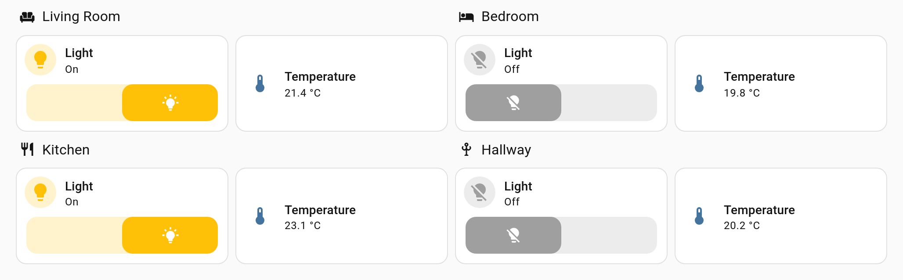
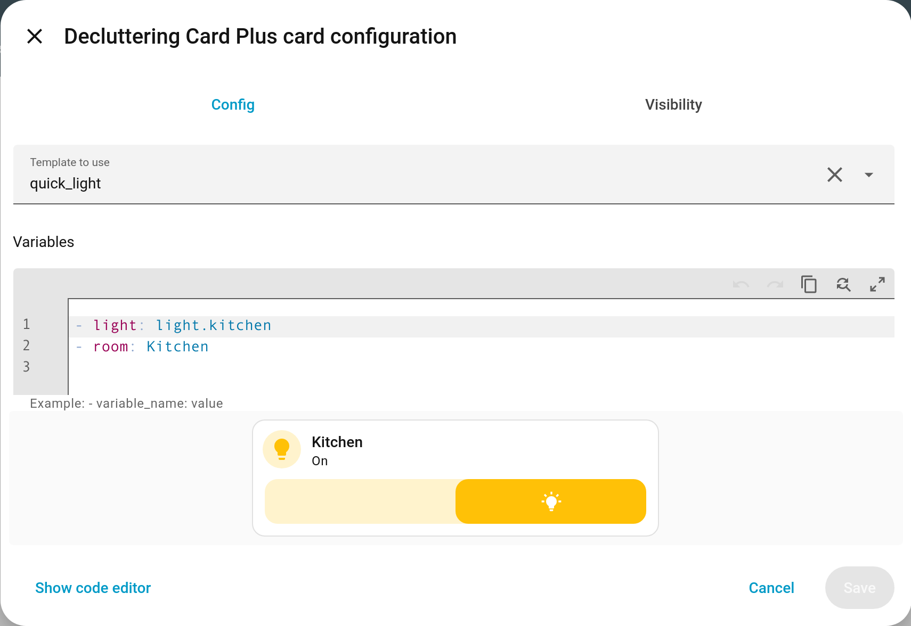
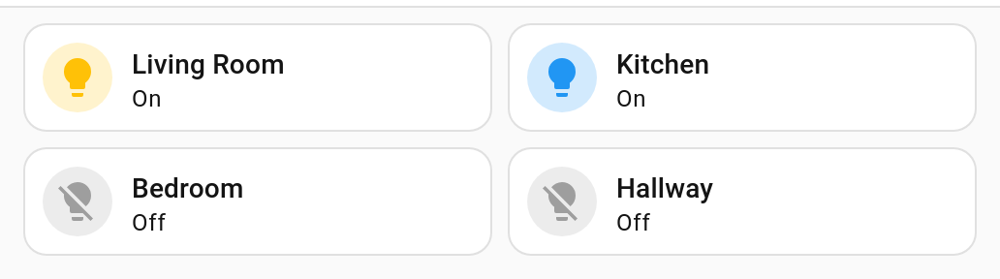

<h1 align="center">Decluttering Card Plus</h1>

<p align="center">
  <strong>Write a card once, use it everywhere.</strong><br>
  A maintained Lovelace card for reusable card templates with variables, for Home Assistant.
</p>

<p align="center">
  <a href="https://github.com/tempus2016/decluttering-card-plus/releases"></a>
  <a href="https://github.com/hacs/default"></a>
  <a href="https://github.com/tempus2016/decluttering-card-plus/blob/main/LICENSE"></a>
  
  <a href="https://github.com/tempus2016/decluttering-card-plus/releases"></a>
</p>

<p align="center">
  <a href="https://github.com/tempus2016/decluttering-card-plus/actions/workflows/build.yml"></a>
  <a href="https://github.com/tempus2016/decluttering-card-plus/actions/workflows/hacs.yml"></a>
  <a href="https://github.com/tempus2016/decluttering-card-plus/commits/main"></a>
  <a href="https://community.home-assistant.io/t/decluttering-card-plus-a-maintained-continuation-of-decluttering-card-badges-cross-dashboard-templates-repeat/1021962"></a>
</p>

We all use the same block of configuration over and over across a Lovelace dashboard, and none
of us want to change the same thing in a hundred places. Define it once as a template, pass in
what differs, and use it everywhere.



*One template, four rooms — each instance passes only the entity and the name.*

📖 **The documentation is in the [wiki][wiki]**: a [quick start][wiki-quickstart], a page per
content type, [variables][wiki-variables], [recipes][wiki-recipes] and
[troubleshooting][wiki-troubleshooting]. This page is the summary.

What changed in each version is on the [releases page][releases].

## Installation

Requires Home Assistant 2024.7 or newer. Badge templates need 2024.8, since that is when Home
Assistant made badges configurable.

### Using HACS

This card is not in the HACS default list, so add it as a custom repository first.

[](https://my.home-assistant.io/redirect/hacs_repository/?owner=tempus2016&repository=decluttering-card-plus&category=lovelace)

To do it by hand, open HACS, then the three-dot menu at the top right, then **Custom
repositories**, and paste this URL in full:

```text
https://github.com/tempus2016/decluttering-card-plus
```

Set the type to **Dashboard** and click **Add**. The card then appears in HACS as *Decluttering
Card Plus*; download it there and reload your browser.

### Manually

Save [decluttering-card-plus.js][latest-release] to `<config directory>/www/` on your Home
Assistant instance, then add it as a dashboard resource:

```yaml
resources:
  - url: /local/decluttering-card-plus.js
    type: module
```

Full instructions, including how to check it loaded, are in [Installation][wiki-installation].

## A first template

Define the template at the root of your dashboard configuration, level with `views:`:

```yaml
decluttering_templates:
  room_light:
    card:
      type: tile
      entity: '[[light]]'
      name: '[[room]]'
```

Then use it as many times as you like, filling in the holes:

```yaml
type: custom:decluttering-card-plus
template: room_light
variables:
  - light: light.living_room
  - room: Living Room
```

Templates can also be defined as a card on the dashboard itself, with a visual editor and a
live preview, if you would rather not touch YAML. Both ways are covered in [Defining
Templates][wiki-defining].



*Picking a template and setting its variables in the visual editor, with a live preview.*

## What it can do

- **[Cards][wiki-cards], [badges][wiki-badges], [Entities rows][wiki-rows] and
  [Picture elements][wiki-elements]** — a template can hold any of the four, and goes wherever
  that kind of content goes.
- **[Variables][wiki-variables]** with defaults, nesting, transforms (`[[room|slug]]`), values
  read from Home Assistant (`[[entity|friendly_name]]`, its area, floor or device), stand-ins
  for what nothing sets (`[[name|default:Unnamed]]`), optional placeholders, and
  dashboard-wide fallbacks.
- **[Repeating a template][wiki-repeating]** — one card per item in a list, or one per entity
  or area Home Assistant knows about, narrowed by domain, area, floor, label, device class or
  integration, with anything you name excluded, sorted, limited, and a card of your own to
  show when nothing matches.
- **Grouping** — a copy per area that knows what is in it, so one card becomes a tile per
  room, each listing that room's lights.

  

  *One `for_each` card, four copies of the same template.*

- **[Sharing templates between dashboards][wiki-sharing-between]** — define once, borrow from
  every other dashboard.
- **[Visibility][wiki-visibility]** conditions inside a template, including leaving out a copy
  that has nothing to show.
- **[Styling][wiki-styling]** with a `style` option and CSS custom properties, a `gap`
  between repeated copies, `grid_options` a template can declare once for every card using
  it, and a `decluttering-container` class to hang CSS off.
- **A starter library** — worked examples of the shapes people build most, installed from
  the editor in one press. Carried in the card, so a dashboard never reaches the internet
  to show one.
- **[Visual editors][wiki-editors]** for both the template and the instance — see what a card
  actually builds, see what uses a template before you change it, rename a template and have
  its uses follow, and [export a template][wiki-sharing] to give to someone else.

## Migrating from `decluttering-card`

**Your existing configuration keeps working.** As well as its own `custom:decluttering-card-plus`
and `custom:decluttering-template-plus` types, this card also registers the original
`custom:decluttering-card` and `custom:decluttering-template` types when the original card is not
installed. The `decluttering_templates` key is unchanged. So you can install this, remove the old
card, and change nothing else.

Do not run both. Whichever loads first claims the original type names, and which one that is
depends on the order the resources were added rather than on anything you can see.
[Migrating from decluttering-card][wiki-migrating] has the detail.

New configuration should use `custom:decluttering-card-plus` and
`custom:decluttering-template-plus`, which are always available.

## Filling the gaps

A placeholder can say what to do when nothing sets it, rather than rendering its own
brackets:

```yaml
name: '[[name|default:Unnamed]]'          # this text instead
name: '[[name|or:label|default:Unnamed]]' # try another variable first
```

`default:` supplies the text itself and `or:` names another variable to try. Both chain
with the transforms, and with each other, so the last word is always something. A variable
set to nothing — unset, `null` or an empty string — counts as a gap; a `0` and a `false`
are values and keep their place.

That is different from `[[name?]]`, which removes the key from the card entirely. Use `?`
when the option should not be there at all, and `default:` when something should be shown.

## Working out what a card built

`debug: true` on a card renders what it built instead of the card itself, with every
variable put in. The editor's **Result** view answers the same question, but not when the
card only misbehaves on a phone, or in a view whose editor is awkward to reach.

`strict: true` turns the usual warnings into a card that refuses. Nothing normally stops a
card rendering — a template can be edited after the cards that use it — but somebody
building a template for other people wants the opposite.

## When something is wrong

The card tries to say what, rather than leaving you to work it out:

- **A template that uses itself** — directly, or through another template that uses it back
  — is refused, naming the whole loop. Without that the tab simply stops responding, since
  every level builds the next one before any of them reach the page.
- **A template name that doesn't exist** offers the closest one that does, which is usually
  the typo or the rename you are looking for.
- **A template defining two things** says which two. It can only define one of `card:`,
  `badge:`, `row:` or `element:`.
- **A repeat producing more than 50 copies** is mentioned in the browser console. It is not
  an error — it may be exactly what you asked for — but it is worth a look.

## Troubleshooting

Common problems and their fixes are in the wiki: [Troubleshooting][wiki-troubleshooting].

For dashboard plugins in general, see
[this guide](https://github.com/thomasloven/hass-config/wiki/Lovelace-Plugins).

## Credits

`decluttering-card-plus` builds on [custom-cards/decluttering-card][upstream], which has not had
a release since April 2023, and on the work of three people:

- [RomRider][romrider] — the original card.
- [j9brown][j9brown] — visual editors, and support for templating entity rows and picture
  elements as well as cards ([upstream PR #78][pr78], unmerged).
- [simbaja][simbaja] — modernisation to lit 3 and TypeScript 5, plus the `style` option.

It is now maintained here as its own project, with badge templates, templates shared between
dashboards, `visibility` support inside templates, and a series of variable-substitution and
layout fixes on top of that work.

This project is maintained by [tempus2016](https://github.com/tempus2016) and is copyright 2026
John MacKinnon. It began as a fork of RomRider's `decluttering-card`, which is copyright 2018
Alexandre Garcia, and parts of that original card remain in it — so both notices are carried in
[LICENSE](LICENSE). Everything here is MIT licensed, as was all of the work it builds on.

## Developers

Fork and then clone the repo to your local machine. From the cloned directory run

```bash
npm install     # or npm ci
npm test        # unit tests for variable substitution
npm run build   # lint, then bundle into dist/
npm start       # rebuild on change, served on :5000 for the dev container
```

[j9brown]: https://github.com/j9brown/decluttering-card
[latest-release]: https://github.com/tempus2016/decluttering-card-plus/releases/latest
[releases]: https://github.com/tempus2016/decluttering-card-plus/releases
[pr78]: https://github.com/custom-cards/decluttering-card/pull/78
[romrider]: https://github.com/RomRider
[simbaja]: https://github.com/simbaja/ha-decluttering-card
[upstream]: https://github.com/custom-cards/decluttering-card
[wiki]: https://github.com/tempus2016/decluttering-card-plus/wiki
[wiki-badges]: https://github.com/tempus2016/decluttering-card-plus/wiki/Badges
[wiki-cards]: https://github.com/tempus2016/decluttering-card-plus/wiki/Cards
[wiki-defining]: https://github.com/tempus2016/decluttering-card-plus/wiki/Defining-Templates
[wiki-editors]: https://github.com/tempus2016/decluttering-card-plus/wiki/Visual-Editors
[wiki-elements]: https://github.com/tempus2016/decluttering-card-plus/wiki/Elements
[wiki-installation]: https://github.com/tempus2016/decluttering-card-plus/wiki/Installation
[wiki-migrating]: https://github.com/tempus2016/decluttering-card-plus/wiki/Migrating-from-decluttering-card
[wiki-quickstart]: https://github.com/tempus2016/decluttering-card-plus/wiki/Quick-Start
[wiki-recipes]: https://github.com/tempus2016/decluttering-card-plus/wiki/Recipes
[wiki-repeating]: https://github.com/tempus2016/decluttering-card-plus/wiki/Repeating-a-Template
[wiki-rows]: https://github.com/tempus2016/decluttering-card-plus/wiki/Rows
[wiki-sharing]: https://github.com/tempus2016/decluttering-card-plus/wiki/Sharing-a-Template
[wiki-sharing-between]: https://github.com/tempus2016/decluttering-card-plus/wiki/Sharing-Templates-Between-Dashboards
[wiki-styling]: https://github.com/tempus2016/decluttering-card-plus/wiki/Styling
[wiki-troubleshooting]: https://github.com/tempus2016/decluttering-card-plus/wiki/Troubleshooting
[wiki-variables]: https://github.com/tempus2016/decluttering-card-plus/wiki/Variables
[wiki-visibility]: https://github.com/tempus2016/decluttering-card-plus/wiki/Visibility
