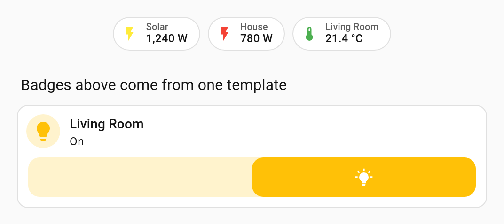
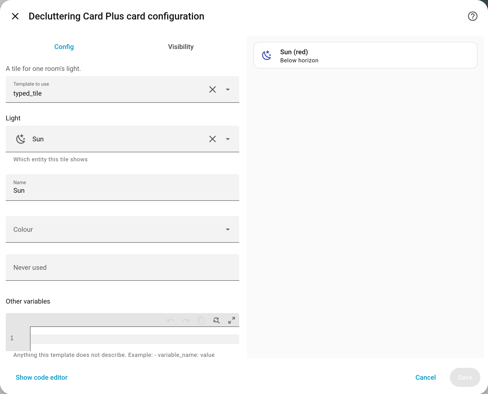
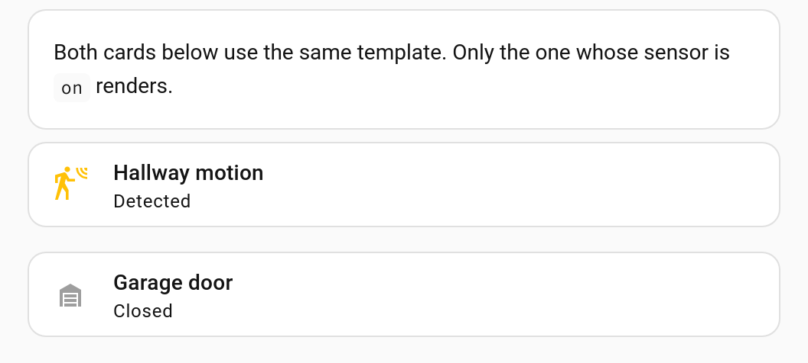
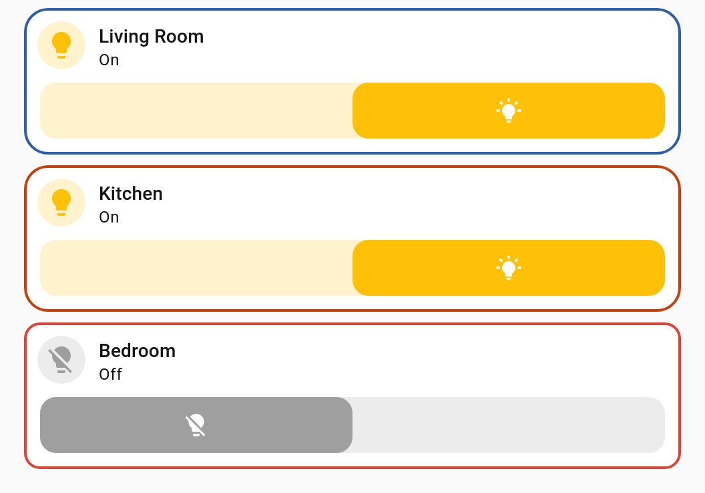

<h1 align="center">Decluttering Card Plus</h1>

<p align="center">
  <strong>Write a card once, use it everywhere.</strong><br>
  A maintained Lovelace card for reusable card templates with variables, for Home Assistant.
</p>

<p align="center">
  <a href="https://github.com/tempus2016/decluttering-card-plus/releases"></a>
  <a href="https://github.com/hacs/default"></a>
  <a href="https://github.com/tempus2016/decluttering-card-plus/blob/main/LICENSE"></a>
  
  <a href="https://github.com/tempus2016/decluttering-card-plus/releases"></a>
</p>

<p align="center">
  <a href="https://github.com/tempus2016/decluttering-card-plus/actions/workflows/build.yml"></a>
  <a href="https://github.com/tempus2016/decluttering-card-plus/actions/workflows/hacs.yml"></a>
  <a href="https://github.com/tempus2016/decluttering-card-plus/commits/main"></a>
  <a href="https://community.home-assistant.io/t/lovelace-decluttering-card/118625"></a>
</p>

This card is for [Lovelace](https://www.home-assistant.io/lovelace) on [Home Assistant](https://www.home-assistant.io/).

📖 **Full documentation is in the [wiki][wiki]** — a [quick start][wiki-quickstart], a page
per content type, [variables][wiki-variables], [recipes][wiki-recipes] and
[troubleshooting][wiki-troubleshooting]. This README is the short version.

We all use multiple times the same block of configuration across our lovelace configuration and we don't want to change the same things in a hundred places across our configuration each time we want to modify something.

`decluttering-card-plus` to the rescue!! This card allows you to reuse multiple times the same configuration in your lovelace configuration to avoid repetition and supports variables and default values.


*One template, four rooms — each instance passes only the entity and the name.*

## Credits

`decluttering-card-plus` builds on [custom-cards/decluttering-card][upstream], which has not
had a release since April 2023, and on the work of three people:

- [RomRider][romrider] — the original card.
- [j9brown][j9brown] — visual editors, and support for templating entity rows and picture
  elements as well as cards ([upstream PR #78][pr78], unmerged).
- [simbaja][simbaja] — modernisation to lit 3 and TypeScript 5, plus the `style` option.

It is now maintained here as its own project, with badge templates, templates shared between
dashboards, `visibility` support inside templates, and a series of variable-substitution and
layout fixes on top of that work.

This project is maintained by [tempus2016](https://github.com/tempus2016) and is copyright
2026 John MacKinnon. It began as a fork of RomRider's `decluttering-card`, which is copyright
2018 Alexandre Garcia, and parts of that original card remain in it — so both notices are
carried in [LICENSE](LICENSE). Everything here is MIT licensed, as was all of the work it
builds on.

## Migrating from `decluttering-card`

**Your existing configuration keeps working.** As well as its own `custom:decluttering-card-plus`
and `custom:decluttering-template-plus` types, this card also registers the original
`custom:decluttering-card` and `custom:decluttering-template` types when the original card is
not installed. The `decluttering_templates` key is unchanged. So you can install this, remove
the old card, and change nothing else.

If you install both cards at once, whichever loads first claims `decluttering-card` and
`decluttering-template`. Home Assistant loads resources in the order they were added, so the
original card usually wins and carries on serving your existing `custom:decluttering-card`
cards — they keep working, but they get none of the fixes here until you remove the original
card. In the other order this card serves them instead, and the original's bundle logs a
`define` error to the console when it finds the name already taken; nothing breaks, because
the type is already being served.

Either way, there is no reason to run both. Remove the original card.

New configuration should use `custom:decluttering-card-plus` and
`custom:decluttering-template-plus`, which are always available.

## Configuration

### Defining your templates

There are two ways to define your templates. You can use both methods together.

#### Option 1. Create a template as a card with the visual editor or with YAML

Add a *Custom: Decluttering Template Plus* card in any view of your dashboard to define your template,
set variables with their default values, and preview the results with those defaults with the
visual editor. The card type is `custom:decluttering-template-plus` in YAML.

You can place the template card anywhere and it will only be visible when the dashboard is in edit mode.
Each template must have a unique name.

**Example:**

```yaml
type: custom:decluttering-template-plus
template: follow_the_sun
card:
  type: entity
  entity: sun.sun
```

#### Option 2. Create a template at the root of your lovelace configuration

Open your dashboard's YAML configuration file or click on the *Raw configuration editor* menu item
in the dashboard.

The templates are defined in an object at the root of your lovelace configuration. This object is
named `decluttering_templates` and it contains your template declarations. Each template must have
a unique name.

**Example:**

```yaml
title: Example Dashboard
decluttering_templates:
  follow_the_sun:
    card:
      type: entity
      entity: sun.sun
  touch_the_sun:
    row:
      type: button
      entity: sun.sun
      action_name: Boop
  hello_sunshine:
    element:
      type: icon
      icon: mdi:weather-sunny
      title: Hello!
      style:
        color: yellow
views:
```

**Syntax:**

```yaml
decluttering_templates:
  <template name>:
    <template content>
  [...]
```

### Sharing templates between dashboards

A dashboard can borrow the templates defined on other dashboards. List them at the root of the
dashboard that wants to use them, by the URL path you see in the address bar:

```yaml
decluttering_templates_from:
  - shared-templates
views:
  - cards:
      - type: custom:decluttering-card-plus
        template: a_template_defined_on_the_other_dashboard
```

Both ways of defining a template are picked up from the other dashboard — the
`decluttering_templates` key and `custom:decluttering-template-plus` cards. A dashboard's own
templates always win, so borrowing can never quietly change a template you have defined
yourself. Use `lovelace` for the original default dashboard.

The other dashboards are read once per browser session, so a change to a shared template shows
up in other dashboards after a refresh.

### Sharing templates with other people

A template card's visual editor has a **Share** tab. Its top half writes the template out as
YAML for you to send to someone else; its bottom half takes YAML somebody sent you and puts it
into the template card you are editing.

A template is only ever as portable as the things it is built from, and the YAML cannot tell
you what those are, so the export names them for you:

```yaml
# Requires these custom cards: custom:mushroom-template-card
# Uses these other templates, which are not included here: my_button_base
type: custom:decluttering-template-plus
template: room_tile
default:
  - entity: sun.sun
card:
  type: custom:mushroom-template-card
  entity: "[[entity]]"
```

Whoever receives this needs Mushroom installed before it will render, and needs `my_button_base`
as well — an export carries one template, so a template that calls others travels with them or
not at all. The comment lines are ordinary YAML comments, so they can be pasted back in as they
are.

Because the exported block keeps its `type:`, it is also just a card. You can paste it straight
into a view in the raw configuration editor instead of using the Share tab.

Importing replaces the template card you are editing, and nothing is written to your dashboard
until you save the card as usual. If the incoming template has the same name as one you already
have, the editor says so and waits for you to press the button a second time, because two
templates sharing a name means only one of them is ever used.

### Adding content to your templates

You can make decluttering templates for cards, badges, entity rows, and picture elements. Each
content type has a different syntax and can be used in different places.

#### [Card](https://www.home-assistant.io/dashboards/cards/)

A decluttering template can hold a standard dashboard card, custom card, or another decluttering card.
It is particularly useful for complex cards such as stacks, grids, and tiles.

**Example:**

```yaml
type: custom:decluttering-template-plus
template: follow_the_sun
card:
  type: entity
  entity: sun.sun
```

**Syntax:**

```yaml
type: custom:decluttering-template-plus
template: <template_name>
card:
  # This is where you put your [Card](https://www.home-assistant.io/dashboards/cards/) configuration (it can be a card embedding other cards)
  type: <card_type>
  [...]
default:
  # An optional list of variables and their default values to substitute into the template
  - <variable_name>: <variable_value>
  - <variable_name>: <variable_value>
  [...]
```

#### [Badge](https://www.home-assistant.io/dashboards/badges/)

A decluttering template can hold a badge. Add it to a view's `badges` list rather than its
cards, using the same `custom:decluttering-card-plus` type.



*A templated badge sits in the badge row exactly like a native one.*

**Example:**

```yaml
type: custom:decluttering-template-plus
template: room_badge
badge:
  type: entity
  entity: '[[entity]]'
  color: '[[colour]]'
default:
  - colour: red
```

**Used in a view:**

```yaml
badges:
  - type: custom:decluttering-card-plus
    template: room_badge
    variables:
      - entity: binary_sensor.front_door
```

**Syntax:**

```yaml
type: custom:decluttering-template-plus
template: <template_name>
badge:
  # This is where you put your [Badge](https://www.home-assistant.io/dashboards/badges/) configuration
  type: <badge_type>
  [...]
default:
  # An optional list of variables and their default values to substitute into the template
  - <variable_name>: <variable_value>
  [...]
```

#### [Entities card](https://www.home-assistant.io/dashboards/entities/) row

A decluttering template can hold an Entities card row such as a Button row or a Conditional row.

**Example:**

```yaml
type: custom:decluttering-template-plus
template: touch_the_sun
row:
  type: button
  entity: sun.sun
  action_name: Boop
```

**Syntax:**

```yaml
type: custom:decluttering-template-plus
template: <template_name>
row:
  # This is where you put your [Entities card](https://www.home-assistant.io/dashboards/entities/) row
  type: <element_type>
  [...]
default:
  # An optional list of variables and their default values to substitute into the template
  - <variable_name>: <variable_value>
  - <variable_name>: <variable_value>
  [...]
```

#### [Picture elements card](https://www.home-assistant.io/dashboards/picture-elements/) element

A decluttering template can hold a Picture elements card element such as an Icon or an Image.

**Example:**

```yaml
type: custom:decluttering-template-plus
template: hello_sunshine
element:
  type: icon
  icon: mdi:weather-sunny
  title: Hello!
  style:
    color: yellow
```

**Syntax:**

```yaml
type: custom:decluttering-template-plus
template: <template_name>
element:
  # This is where you put your [Picture elements card](https://www.home-assistant.io/dashboards/picture-elements/) element configuration
  type: <element_type>
  [...]
default:
  # An optional list of variables and their default values to substitute into the template
  - <variable_name>: <variable_value>
  - <variable_name>: <variable_value>
  [...]
```

#### Variables

Templates can contain variables. Each variable will later be replaced by a real value when you
instantiate a card which uses this template.

A variable needs to be enclosed in double square brackets `[[variable_name]]`. If a variable is alone
on its line, enclose it in single quotes: `'[[variable_name]]'`.

You can also define default values for your variables in the `default` object. The visual editor uses the
provided default values to render the preview.

**Example:**

```yaml
type: custom:decluttering-template-plus
template: touch_anything
row:
  type: button
  entity: '[[what]]'
  action_name: '[[how]]'
default:
  what: sun.sun
  how: 'Boop'
```

#### Describing your variables

A template can describe the variables it takes, rather than only giving them defaults. Each
description becomes a real control in the editor of every card that uses the template, so
picking an entity is an entity picker rather than a line of hand-typed YAML.

```yaml
type: custom:decluttering-template-plus
template: room_tile
description: A tile for one room's light.
variables:
  - name: entity
    label: Light
    description: Which entity this tile shows
    selector:
      entity:
        domain: light
  - name: colour
    label: Colour
    selector:
      select:
        options: [red, blue, amber]
    default: red
card:
  type: tile
  entity: '[[entity]]'
  name: '[[label]] ([[colour]])'
```



*A template that describes its variables gets pickers, labels and helper text, and the
template's own description above them.*

**Syntax:**

| Name | Type | Requirement | Description
| ---- | ---- | ------- | -----------
| name | string | **Required** | The variable's name, as written in `[[name]]`
| label | string | **Optional** | What the editor calls it. Defaults to the name
| description | string | **Optional** | Helper text shown under the control
| selector | object | **Optional** | Any [Home Assistant selector](https://www.home-assistant.io/docs/blueprint/selectors/). Defaults to a plain text box
| default | any | **Optional** | The value to use when a card does not set one

`description:` on the template itself is shown above the controls, so whoever uses the
template can see what it is for.

Values are resolved in this order: what the card passes, then a declaration's `default`,
then the `default:` list. Anything the template does not describe is still editable, in an
**Other variables** box below the controls, and a template that describes nothing is edited
exactly as before. Declaring variables is entirely optional.

The editors also point out the two mistakes that are easy to make and hard to see: a
variable the template uses that has no value and no default, and a value set on a card that
the template never uses. Both are warnings; neither stops you saving.

#### Repeating a template

A card can render its template once per item in a list, which saves pasting the same
instance block out four times when only the entity changes.

```yaml
type: custom:decluttering-card-plus
template: room_tile
columns: 2
variables:
  - colour: amber
for_each:
  - entity: light.kitchen
    name: Kitchen
  - entity: light.hall
    name: Hall
  - entity: light.shed
    name: Shed
    colour: blue
```

Each item holds the variables for that copy. Anything set in the card's own `variables` is
shared by every copy, and an item can override it — `colour` above is amber everywhere
except the shed.

`columns` lays the copies out side by side; leave it out, or set it to `1`, and they stack
vertically. The copies are handed to Home Assistant's own grid and vertical-stack cards, so
they behave exactly like any other card in your layout.

`for_each` needs a template that defines a `card`. An empty list renders nothing rather than
failing, so a list built from a helper can be empty without breaking the dashboard.

**Syntax:**

| Name | Type | Requirement | Description
| ---- | ---- | ------- | -----------
| for_each | list | **Optional** | One copy of the template per item; each item is a set of variables for that copy
| columns | number | **Optional** | How many copies sit side by side. Defaults to 1, which stacks them

#### Nested variables

A variable's value can itself contain variables. Substitution repeats until nothing is left
to replace, so the order you declare them in does not matter.

```yaml
type: custom:decluttering-template-plus
template: area_sensor
card:
  type: tile
  entity: '[[entity]]'
  name: '[[label]]'
default:
  - label: '[[area]] sensor'
  - area: Garden
  - entity: sun.sun
```

Used like this, `label` resolves to `Shed sensor` — a value you pass in always wins over the
template's default, including when the placeholder only appears because of another substitution:

```yaml
type: custom:decluttering-card-plus
template: area_sensor
variables:
  - area: Shed
```

A variable that refers to itself cannot be resolved. Substitution gives up after 10 passes and
logs a warning to the browser console rather than looping forever.

### Using the card

If your template content is a card, add a *Custom: Decluttering Card Plus* to your dashboard
to instantiate your template, set variables, and preview the results with the visual editor.


*Picking a template and setting its variables in the visual editor, with a live preview.*
The card type is `custom:decluttering-card-plus` in YAML.

If your template content is an Entities card row, first add an *Entities card* to your dashboard or
open an existing one. Then switch to the code editor and add a new item to the `entities`
list in YAML as shown below.

If your template content is a Picture elements card element, first add a *Picture elements* card to your
dashboard or open an existing one. Then switch to the code editor and add a new item to the
`elements` list in YAML as shown below.

You can also use templates in different places than they were intended. For example, an
Entities card row or Picture elements card element can be displayed as a card in the dashboard but
it might not look right.

**Example which references the previous templates:**

```yaml
type: vertical-stack
cards:
  # A card
  - type: custom:decluttering-card-plus
    template: follow_the_sun
  # An Entities card
  - type: entities
    entities:
      # An entity row
      - type: custom:decluttering-card-plus
        template: touch_the_sun
      # An entity row with variables using default values
      - type: custom:decluttering-card-plus
        template: touch_anything
      # An entity row with variables using specified values
      - type: custom:decluttering-card-plus
        template: touch_anything
        variables:
          - what: sensor.moon_phase
          - how: 'Kiss'
  # A Picture elements card
  - type: picture-elements
    elements:
      - type: custom:decluttering-card-plus
        template: hello_sunshine
        style:
          top: 50%
          left: 33%
      - type: custom:decluttering-card-plus
        template: hello_sunshine
        style:
          top: 50%
          left: 66%
```

**Syntax:**

| Name | Type | Requirement | Description
| ---- | ---- | ------- | -----------
| type | string | **Required** | `custom:decluttering-card-plus`
| template | object | **Required** | Name of your template
| variables | list | **Optional** | List of variables and their values to replace in the template content
| style | string | **Optional** | CSS styles to inject into the card. Supports variable replacement.

### Visibility

Cards inside a template support Home Assistant's own `visibility` conditions, and those
conditions can use variables:

```yaml
type: custom:decluttering-template-plus
template: occupancy
card:
  type: tile
  entity: '[[sensor]]'
  visibility:
    - condition: state
      entity: '[[sensor]]'
      state: '[[show_when]]'
default:
  - show_when: 'on'
```



*The same template shown and hidden by its own visibility conditions.*

```yaml
type: custom:decluttering-card-plus
template: occupancy
variables:
  - sensor: binary_sensor.hallway_motion
```

When a card is hidden by its conditions the decluttering card collapses with it, so it
leaves no gap in the layout. While the dashboard is in edit mode the template preview is
shown regardless of its conditions, so you can still see what you are editing.

`visibility` also works on the `custom:decluttering-card-plus` card itself, where Home
Assistant applies it in the usual way.

### Styling

The card supports injecting custom CSS styles directly into the card. This is useful for customizing the appearance of templates and instances without needing external tools like `card-mod`.

#### `decluttering-container` class

The host element is automatically assigned the `decluttering-container` class. You can use this class to target the card itself in your styles.

**Example:**

```yaml
- type: custom:decluttering-card-plus
  template: my_styled_card
  variables:
    - color: red
  style: |
    :host(.decluttering-container) {
      border: 2px solid [[color]];
    }
```



*A template styled through the style option, with the colour passed in as a variable.*

#### Template styles

You can also define styles within your templates. These styles will be injected whenever the template is used.

**Example:**

```yaml
decluttering_templates:
  my_styled_card:
    card:
      type: entity
      entity: sun.sun
    style: |
      :host {
        --ha-card-background: var(--primary-background-color);
        --ha-card-border-radius: 15px;
      }
```

#### Use CSS custom properties to style the card itself

The CSS is injected into this card's shadow root, and each Home Assistant card lives in a
shadow root of its own nested inside it. CSS does not cross a shadow boundary, so a
selector such as `ha-card { ... }` never matches the wrapped card. Custom properties do
cross, because they inherit — so `--ha-card-background` works where `background-color`
on `ha-card` does not.

`:host`, `:host(.decluttering-container)` and `hui-card` all refer to elements in this
card's own shadow root, so those work normally.

See [Styling][wiki-styling] in the wiki for the full explanation and a table of what does
and does not reach the card.

## Installation

Requires Home Assistant 2024.7 or newer. Badge templates need 2024.8, since that is when
Home Assistant made badges configurable.

### Using HACS

[](https://my.home-assistant.io/redirect/hacs_repository/?owner=tempus2016&repository=decluttering-card-plus&category=lovelace)

### Manually

#### Step 1

Save [decluttering-card-plus.js][latest-release] to `<config directory>/www/decluttering-card-plus.js` on your Home Assistant instance.

**Example:**

```bash
wget https://raw.githubusercontent.com/tempus2016/decluttering-card-plus/main/dist/decluttering-card-plus.js
mv decluttering-card-plus.js /config/www/
```

#### Step 2

Link `decluttering-card-plus` inside your `ui-lovelace.yaml` or Raw Editor in the UI Editor

```yaml
resources:
  - url: /local/decluttering-card-plus.js
    type: module
```

## Troubleshooting

Common problems and their fixes are in the wiki: [Troubleshooting][wiki-troubleshooting].

For dashboard plugins in general, see
[this guide](https://github.com/thomasloven/hass-config/wiki/Lovelace-Plugins).

## Developers

Fork and then clone the repo to your local machine. From the cloned directory run

```bash
npm install     # or npm ci
npm test        # unit tests for variable substitution
npm run build   # lint, then bundle into dist/
npm start       # rebuild on change, served on :5000 for the dev container
```

[j9brown]: https://github.com/j9brown/decluttering-card
[latest-release]: https://github.com/tempus2016/decluttering-card-plus/releases/latest
[pr78]: https://github.com/custom-cards/decluttering-card/pull/78
[romrider]: https://github.com/RomRider
[simbaja]: https://github.com/simbaja/ha-decluttering-card
[upstream]: https://github.com/custom-cards/decluttering-card
[wiki]: https://github.com/tempus2016/decluttering-card-plus/wiki
[wiki-quickstart]: https://github.com/tempus2016/decluttering-card-plus/wiki/Quick-Start
[wiki-recipes]: https://github.com/tempus2016/decluttering-card-plus/wiki/Recipes
[wiki-styling]: https://github.com/tempus2016/decluttering-card-plus/wiki/Styling
[wiki-troubleshooting]: https://github.com/tempus2016/decluttering-card-plus/wiki/Troubleshooting
[wiki-variables]: https://github.com/tempus2016/decluttering-card-plus/wiki/Variables
