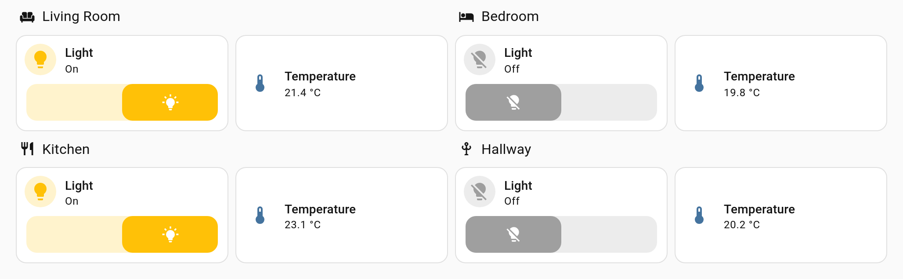
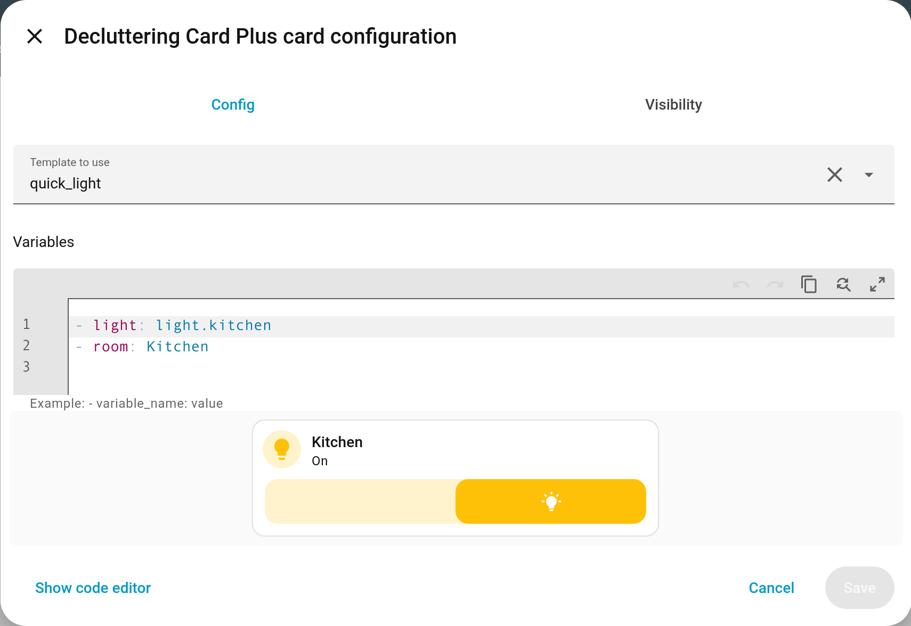
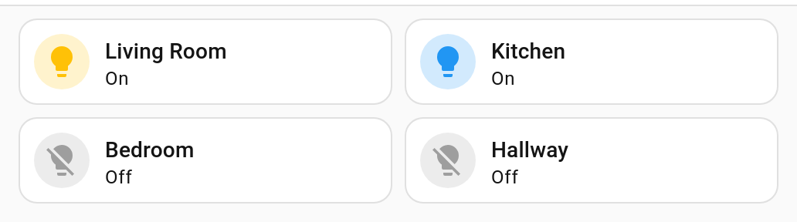

<h1 align="center">Decluttering Card Plus</h1>

<p align="center">
  <strong>Write a card once, use it everywhere.</strong><br>
  A maintained Lovelace card for reusable card templates with variables, for Home Assistant.
</p>

<p align="center">
  <a href="https://github.com/tempus2016/decluttering-card-plus/releases"></a>
  <a href="https://github.com/hacs/default"></a>
  <a href="https://github.com/tempus2016/decluttering-card-plus/blob/main/LICENSE"></a>
  
  <a href="https://github.com/tempus2016/decluttering-card-plus/releases"></a>
</p>

<p align="center">
  <a href="https://github.com/tempus2016/decluttering-card-plus/actions/workflows/build.yml"></a>
  <a href="https://github.com/tempus2016/decluttering-card-plus/actions/workflows/hacs.yml"></a>
  <a href="https://github.com/tempus2016/decluttering-card-plus/commits/main"></a>
  <a href="https://community.home-assistant.io/t/decluttering-card-plus-a-maintained-continuation-of-decluttering-card-badges-cross-dashboard-templates-repeat/1021962"></a>
</p>

We all use the same block of configuration over and over across a Lovelace dashboard, and none
of us want to change the same thing in a hundred places. Define it once as a template, pass in
what differs, and use it everywhere.



*One template, four rooms — each instance passes only the entity and the name.*

📖 **The documentation is in the [wiki][wiki]**: a [quick start][wiki-quickstart], a page per
content type, [variables][wiki-variables], [recipes][wiki-recipes] and
[troubleshooting][wiki-troubleshooting]. This page is the summary.

What changed in each version is on the [releases page][releases].

## Installation

Requires Home Assistant 2024.7 or newer. Badge templates need 2024.8, since that is when Home
Assistant made badges configurable.

### Using HACS

This card is not in the HACS default list, so add it as a custom repository first.

[](https://my.home-assistant.io/redirect/hacs_repository/?owner=tempus2016&repository=decluttering-card-plus&category=lovelace)

To do it by hand, open HACS, then the three-dot menu at the top right, then **Custom
repositories**, and paste this URL in full:

```text
https://github.com/tempus2016/decluttering-card-plus
```

Set the type to **Dashboard** and click **Add**. The card then appears in HACS as *Decluttering
Card Plus*; download it there and reload your browser.

### Manually

Save [decluttering-card-plus.js][latest-release] to `<config directory>/www/` on your Home
Assistant instance, then add it as a dashboard resource:

```yaml
resources:
  - url: /local/decluttering-card-plus.js
    type: module
```

Full instructions, including how to check it loaded, are in [Installation][wiki-installation].

## A first template

Define the template at the root of your dashboard configuration, level with `views:`:

```yaml
decluttering_templates:
  room_light:
    card:
      type: tile
      entity: '[[light]]'
      name: '[[room]]'
```

Then use it as many times as you like, filling in the holes:

```yaml
type: custom:decluttering-card-plus
template: room_light
variables:
  - light: light.living_room
  - room: Living Room
```

Templates can also be defined as a card on the dashboard itself, with a visual editor and a
live preview, if you would rather not touch YAML. Both ways are covered in [Defining
Templates][wiki-defining].



*Picking a template and setting its variables in the visual editor, with a live preview.*

## What it can do

- **[Cards][wiki-cards], [badges][wiki-badges], [Entities rows][wiki-rows] and
  [Picture elements][wiki-elements]** — a template can hold any of the four, and goes wherever
  that kind of content goes.
- **[Variables][wiki-variables]** with defaults, nesting, transforms (`[[room|slug]]`), values
  read from Home Assistant (`[[entity|friendly_name]]`, its domain, object id, labels, area,
  floor or device), values a template works out for itself with `let:`, stand-ins for what
  nothing sets (`[[name|default:Unnamed]]`), values that only appear when another is set
  (`[[name|if:other]]`), real yes/no values for options that switch on and off
  (`[[name|bool]]`), optional placeholders, dashboard-wide
  fallbacks, and values a whole view, or one section of it, sets for every card in it. A
  declaration can say what a good value looks like (`pattern:`, `allowed:`), fold into a
  section of the editor (`group:`), or take a whole card.
- **[Repeating a template][wiki-repeating]** — one card per item in a list, or one per entity
  area, device, floor or label Home Assistant knows about, narrowed by domain, area, floor,
  label, device class or integration, with anything you name excluded, sorted, limited, and a card of your own to
  show when nothing matches. The order can run backwards, break ties on a second key, or
  follow a state attribute; `offset` splits one long list across two cards, `require` drops a
  copy that came out empty, and `overrides` gives one copy its own variables.
- **Grouping** — a copy per area that knows what is in it, so one card becomes a tile per
  room, each listing that room's lights — or `group_by:` a domain, floor or label.

  

  *One `for_each` card, four copies of the same template.*

- **Whole sections and badges, repeated** — a view strategy writes out a section, or a badge,
  per item: one section per room, each with its own heading and background, reflowing with
  the screen like any other sections view. Ordinary sections and badges sit alongside.

  ```yaml
  views:
    - title: Rooms
      strategy:
        type: custom:decluttering-card-plus
        sections:
          - for_each_from: { areas: true }
            section:
              type: grid
              cards:
                - type: heading
                  heading: '[[area]]'
                - type: custom:decluttering-card-plus
                  template: room_lights
  ```

  A templated card inside a repeated section is handed that copy's values, so `room_lights`
  above gets `area_id` without being told. A generated view is edited as YAML, from the
  view's pencil and then the menu. A card already repeating in a section can be turned
  into this from its editor: **Give each copy its own section** rewrites the view for you.

- **[Sharing templates between dashboards][wiki-sharing-between]** — define once, borrow from
  every other dashboard, or from all of them at once with `'*'`. A dashboard at the path
  `decluttering-templates` *(v1.13.0+)* is borrowed from by every dashboard without being
  named, so a template library written there, with its `decluttering_defaults`, is available
  everywhere. A dashboard's own templates, and any it names, win over the library's.
- **Offered in the add-card dialog** *(v1.13.0+)* — a template with `suggest_for:` appears
  under Community when you pick a matching entity in the dialog's By entity tab, with the
  entity filled in as `entity`. It takes the filters a repeat does: `suggest_for:
  { domain: camera, area: Garden }`. Badge templates are offered in the badge dialog.
  Needs Home Assistant 2026.6 or later.
- **Templates built on templates** — `extends:` lets a family of templates differ by a line,
  and `category:` groups a big collection in the picker. A card nested inside a template
  can take every variable of the card around it with `inherit_variables: true` *(v1.13.0+)*.
- **One-off tweaks without a new template** *(v1.12.0+)* — a card's own `card:` block is laid over what
  its template builds, so a single card can change an icon or an action and nothing else.
  Mappings merge key by key, lists replace, and `null` drops a key the template sets.
- **[Visibility][wiki-visibility]** conditions inside a template, including leaving out a copy
  that has nothing to show.
- **[Styling][wiki-styling]** with a `style` option and CSS custom properties, a `gap`
  between repeated copies, `grid_options` a template can declare once for every card using
  it, and a `decluttering-container` class to hang CSS off.
- **A starter library** — worked examples of the shapes people build most, picked from a
  dropdown in the editor and installed into the view you are working on. Carried in the
  card, so a dashboard never reaches the internet to show one.
- **[Visual editors][wiki-editors]** for both the template and the instance — see what a card
  actually builds, see what uses a template before you change it (on this dashboard and on
  every other one), see what one real card becomes under the edit in hand, rename a template
  and have its uses follow, and [export a template][wiki-sharing] to give to someone else,
  with the templates it calls bundled in.
- **A health panel** — cards pointing at a template that is not there, cards leaving a
  variable unset, templates nothing uses: the console warnings gathered into one place.
- **Turning cards into templates and back** — declutter a card already on the dashboard into
  a template and swap the original for it, or eject a card so it becomes exactly what the
  template built and stops depending on it.

## Is this the right card?

| You want | Reach for |
| --- | --- |
| The same block of card YAML in a dozen places, with a few values changed | **this card** |
| A card per light, room or sensor, kept up to date as you add things | **this card** — [`for_each_from`][wiki-repeating] |
| A list that reorders itself by what is on, or hides what is off *right now* | [auto-entities][auto-entities] — this card builds once and does not follow state |
| One button styled every possible way, with heavy CSS and JS templating | [button-card][button-card] and its own templates |
| To compute a value from several entities | a Home Assistant [template sensor][template-sensor], then show it with any card |

They coexist happily: a template here can hold a button-card, and an auto-entities card can
hold cards built from a template here.

## Which Home Assistant

| You need | For |
| --- | --- |
| 2024.7 | everything, unless it is listed below |
| 2024.8 | `badge:` templates — Home Assistant made badges configurable in that release |
| 2024.11 | `grid_options`, on a template or a card, which is what the sections view reads |

Newer releases are fine. If a feature quietly does nothing, check this table first.

## Try it without committing to anything

[`examples/demo-dashboard.yaml`](examples/demo-dashboard.yaml) is a whole dashboard that
exercises most of what the card does. Make a new dashboard, open its raw configuration
editor, and paste it in — everything it needs is either built into the card or taken from
your own Home Assistant.

## Migrating from `decluttering-card`

**Your existing configuration keeps working.** As well as its own `custom:decluttering-card-plus`
and `custom:decluttering-template-plus` types, this card also registers the original
`custom:decluttering-card` and `custom:decluttering-template` types when the original card is not
installed. The `decluttering_templates` key is unchanged. So you can install this, remove the old
card, and change nothing else.

Do not run both. Whichever loads first claims the original type names, and which one that is
depends on the order the resources were added rather than on anything you can see.
[Migrating from decluttering-card][wiki-migrating] has the detail.

New configuration should use `custom:decluttering-card-plus` and
`custom:decluttering-template-plus`, which are always available.

## Filling the gaps

A placeholder can say what to do when nothing sets it, rather than rendering its own
brackets:

```yaml
name: '[[name|default:Unnamed]]'          # this text instead
name: '[[name|or:label|default:Unnamed]]' # try another variable first
```

`default:` supplies the text itself and `or:` names another variable to try. Both chain
with the transforms, and with each other, so the last word is always something. A variable
set to nothing — unset, `null` or an empty string — counts as a gap; a `0` and a `false`
are values and keep their place. `none` is not a gap either: it is the text "none".

`or:` only takes a variable name (letters, digits, `_` and `-`), so text with a space in it
belongs in a `default:`. Put `or:` first and `default:` last: a `default:` with text in it
always fills the gap, so an `or:` after it never gets a turn. An empty `default:` is still a
gap, so the next step does get one, and from v1.12.1 `[[name|default:?]]` drops the key
just as `[[name?]]` does.

That is different from `[[name?]]`, which removes the key from the card entirely. Use `?`
when the option should not be there at all, and `default:` when something should be shown.
From v1.12.0, a block left with nothing in it goes too, so a whole section can hang on one
variable:

```yaml
features:
  - type: '[[light_type?]]'   # no light_type, no features
```

`if:` *(v1.12.0+)* makes a value depend on a different variable. `[[name|if:other]]` keeps the value
only while `other` is a yes, and `[[name|if:other=text]]` only while `other` is exactly that
text. When the condition fails, the placeholder is treated as unset, so `?` drops it and a
`default:` after it still applies. It works on whole mappings too, which means one card can
choose which list items it gets:

```yaml
elements:
  - '[[car_element|if:car_entity?]]'          # only on cards that name a car_entity
go2rtc: '[[go2rtc_block|if:live_provider=go2rtc?]]'
```

`bool` *(v1.12.0+)* is for options that want a real `true` or `false`. A card reads the
word `"false"` as switched on, so `hide_state: '[[compact|bool]]'` turns `yes`, `on` or
`1` into `true`, and `no`, `off`, `0`, nothing at all or an unset variable into `false`.

## Templates inside templates

A template can hold decluttering cards of its own, a stack of two cameras say. Each of those
gets only the variables written on it, so a stack that needs the same twenty values in both
cards has to pass every one down by name.

`inherit_variables: true` *(v1.13.0+)* on the nested card hands it everything the card
around it has instead: what that card was given, what its view sets and what its template
defaults to. Anything the nested card writes for itself still wins.

```yaml
cam_backup:
  card:
    type: vertical-stack
    cards:
      - type: custom:decluttering-card-plus
        template: camera
        inherit_variables: true
      - type: custom:decluttering-card-plus
        template: camera
        inherit_variables: true
        variables:
          - camera_entity: '[[direct_camera_entity]]'   # this one differs
```

Placeholders in the values are filled in by the outer card before they are handed down, and
it works through any number of levels as long as each nested card asks. Two things stay
behind: the outer template's `let:` values, which are its own internals, and the dashboard's
`decluttering_defaults`, which every card reads for itself anyway. It is off unless asked
for, because a value handed down beats the nested template's own default for the same name.

## Working out what a card built

`debug: true` on a card renders what it built instead of the card itself, with every
variable put in. The editor's **Result** view answers the same question, but not when the
card only misbehaves on a phone, or in a view whose editor is awkward to reach.

`debug: yaml` *(v1.13.0+)* shows the same thing as YAML rather than JSON, which is easier
to hold up against a card you know works, or to paste straight back into a dashboard.

`debug: console` *(v1.13.0+)* leaves the card looking as it should and writes how it was
built to the browser console instead: every variable with where its value came from (the
card, a `let:`, a default, the view, the card around it), what each placeholder turned into,
which options an empty variable took out, the finished config, and how long it took. Any
template card nested inside logs its own entry too, labelled with the templates it sits in,
so you can see what each level was given. Open the developer tools (F12) and look for
`decluttering-card-plus:` lines. The time covers building the config, not Home Assistant
drawing the card afterwards.

`strict: true` turns the usual warnings into a card that refuses. Nothing normally stops a
card rendering — a template can be edited after the cards that use it — but somebody
building a template for other people wants the opposite.

## When something is wrong

The card tries to say what, rather than leaving you to work it out:

- **A template that uses itself** — directly, or through another template that uses it back
  — is refused, naming the whole loop. Without that the tab simply stops responding, since
  every level builds the next one before any of them reach the page.
- **A template name that doesn't exist** offers the closest one that does, which is usually
  the typo or the rename you are looking for.
- **A template defining two things** says which two. It can only define one of `card:`,
  `badge:`, `row:` or `element:`.
- **A repeat producing more than 50 copies** is mentioned in the browser console. It is not
  an error — it may be exactly what you asked for — but it is worth a look.

## Languages (v1.2.0+)

Everything the card says — its editors, its error messages, its Share and Where-used
tools, even its console warnings — follows the language set in your Home Assistant
profile. Dutch, English, French, German, Portuguese and Spanish are included; anything a
translation does not cover falls back to English.

Adding a language is one file and no code. Copy
[`src/locales/en.json`](src/locales/en.json) to `src/locales/<code>.json` — `de.json`,
`it.json` — translate the values, and register it in
[`src/localize.ts`](src/localize.ts) by adding one import and one entry to `LANGUAGES`.
Leave the `{placeholders}` and any `[[name]]` brackets exactly as they are: the card fills
those in. `npm test` lists any keys you have missed and checks that every placeholder
survived. The wiki's [Translations page][wiki-translations] walks through it, including
how to send one in without touching git.

[wiki-translations]: https://github.com/tempus2016/decluttering-card-plus/wiki/Translations

## Troubleshooting

Common problems and their fixes are in the wiki: [Troubleshooting][wiki-troubleshooting].

For dashboard plugins in general, see
[this guide](https://github.com/thomasloven/hass-config/wiki/Lovelace-Plugins).

## Credits

`decluttering-card-plus` builds on [custom-cards/decluttering-card][upstream], which has not had
a release since April 2023, and on the work of three people:

- [RomRider][romrider] — the original card.
- [j9brown][j9brown] — visual editors, and support for templating entity rows and picture
  elements as well as cards ([upstream PR #78][pr78], unmerged).
- [simbaja][simbaja] — modernisation to lit 3 and TypeScript 5, plus the `style` option.

It is now maintained here as its own project, with badge templates, templates shared between
dashboards, `visibility` support inside templates, and a series of variable-substitution and
layout fixes on top of that work.

This project is maintained by [tempus2016](https://github.com/tempus2016) and is copyright 2026
John MacKinnon. It began as a fork of RomRider's `decluttering-card`, which is copyright 2018
Alexandre Garcia, and parts of that original card remain in it — so both notices are carried in
[LICENSE](LICENSE). Everything here is MIT licensed, as was all of the work it builds on.

## Contributing

[CONTRIBUTING.md](CONTRIBUTING.md) covers building, testing, the commit format releases are
cut from, and the handful of changes that tend to get pushed back. Security reports go
through [SECURITY.md](SECURITY.md).

## Developers

Fork and then clone the repo to your local machine. From the cloned directory run

```bash
npm install     # or npm ci
npm test        # unit tests for variable substitution
npm run build   # lint, then bundle into dist/
npm start       # rebuild on change, served on :5000 for the dev container
```

[j9brown]: https://github.com/j9brown/decluttering-card
[latest-release]: https://github.com/tempus2016/decluttering-card-plus/releases/latest
[releases]: https://github.com/tempus2016/decluttering-card-plus/releases
[pr78]: https://github.com/custom-cards/decluttering-card/pull/78
[romrider]: https://github.com/RomRider
[simbaja]: https://github.com/simbaja/ha-decluttering-card
[upstream]: https://github.com/custom-cards/decluttering-card
[wiki]: https://github.com/tempus2016/decluttering-card-plus/wiki
[wiki-badges]: https://github.com/tempus2016/decluttering-card-plus/wiki/Badges
[wiki-cards]: https://github.com/tempus2016/decluttering-card-plus/wiki/Cards
[wiki-defining]: https://github.com/tempus2016/decluttering-card-plus/wiki/Defining-Templates
[wiki-editors]: https://github.com/tempus2016/decluttering-card-plus/wiki/Visual-Editors
[wiki-elements]: https://github.com/tempus2016/decluttering-card-plus/wiki/Elements
[wiki-installation]: https://github.com/tempus2016/decluttering-card-plus/wiki/Installation
[wiki-migrating]: https://github.com/tempus2016/decluttering-card-plus/wiki/Migrating-from-decluttering-card
[wiki-quickstart]: https://github.com/tempus2016/decluttering-card-plus/wiki/Quick-Start
[wiki-recipes]: https://github.com/tempus2016/decluttering-card-plus/wiki/Recipes
[wiki-repeating]: https://github.com/tempus2016/decluttering-card-plus/wiki/Repeating-a-Template
[wiki-rows]: https://github.com/tempus2016/decluttering-card-plus/wiki/Rows
[wiki-sharing]: https://github.com/tempus2016/decluttering-card-plus/wiki/Sharing-a-Template
[wiki-sharing-between]: https://github.com/tempus2016/decluttering-card-plus/wiki/Sharing-Templates-Between-Dashboards
[wiki-styling]: https://github.com/tempus2016/decluttering-card-plus/wiki/Styling
[wiki-troubleshooting]: https://github.com/tempus2016/decluttering-card-plus/wiki/Troubleshooting
[wiki-variables]: https://github.com/tempus2016/decluttering-card-plus/wiki/Variables
[wiki-visibility]: https://github.com/tempus2016/decluttering-card-plus/wiki/Visibility

[auto-entities]: https://github.com/thomasloven/lovelace-auto-entities
[button-card]: https://github.com/custom-cards/button-card
[template-sensor]: https://www.home-assistant.io/integrations/template/
